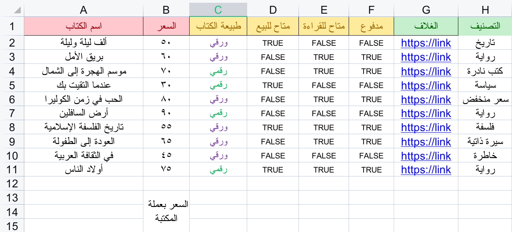

# تحميل بيانات المكتبة بإستخدام ملف Excel

> ملاحظة : لا بد من تنسيق الملف بشكل موحد حتى يتم التحميل بنجاح.

اتبع(ي) هذه الخطوات البسيطة بالترتيب:
## خطوة 1: معاني الألوان والخانات 
	1. برتقالي: ضروري أن يكون موجود
	2. الأخضر: خياري أن يكون موجود
	3. الأحمر : لابد أن يكون موجود
## خطوة 2: تجهيز ملف بياناتك 

*يمكنك استخدام هذا الملف ووضع البيانات فيه ومن ثم تحميل الملف بعد الانتهاء*

[ExcelFormat](ExcelFormat.xlsx) حمل الملف من هنا