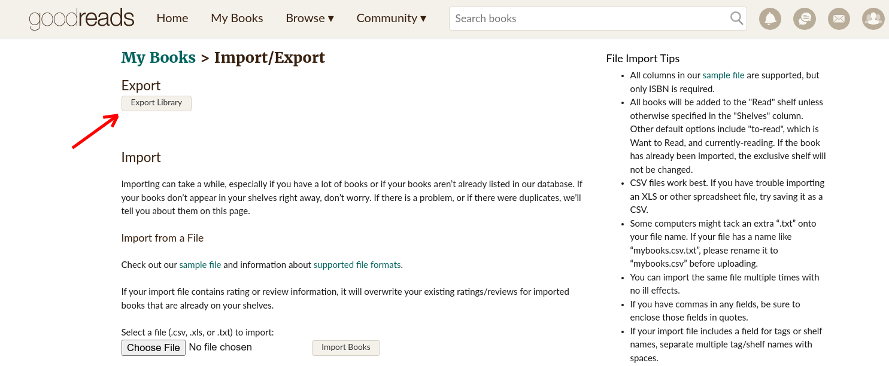
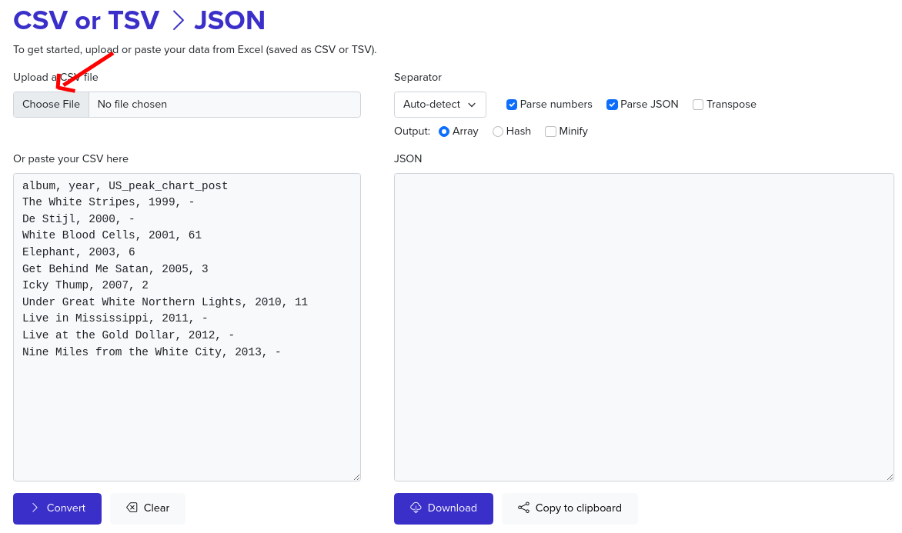
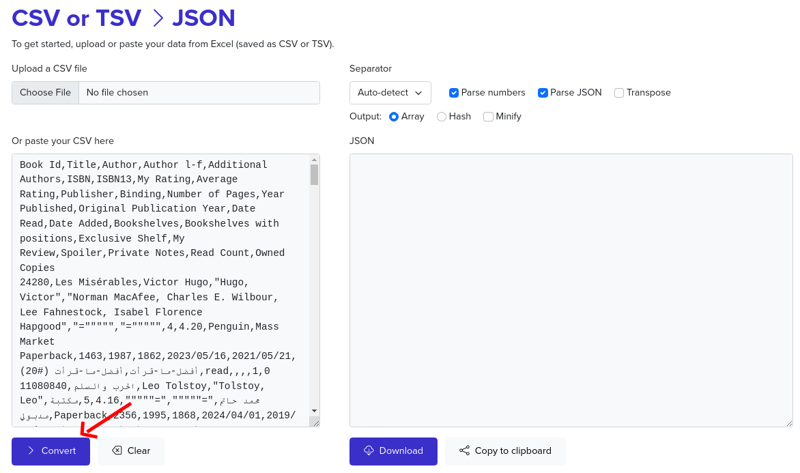
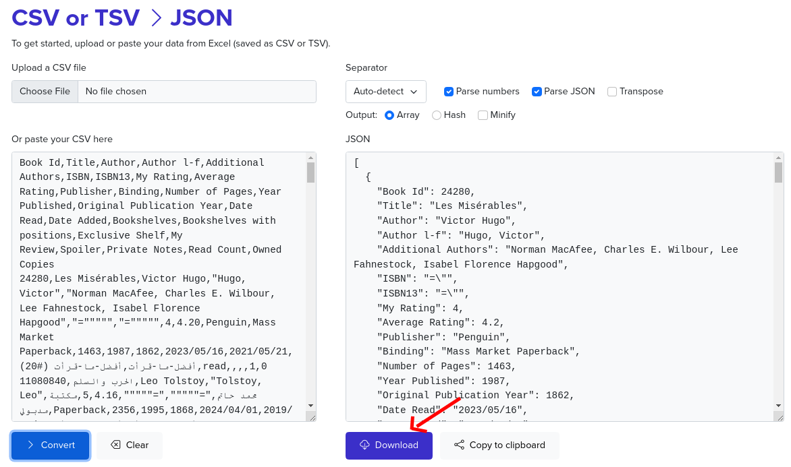

# تحميل بيانات Goodreads

> ملاحظة : نظراَ لعدم وجود API ل Goodreads لا بد من تحميل البيانات يدوياً.

اتبع(ي) هذه الخطوات البسيطة بالترتيب:
## خطوة 1: تحميل ملف بياناتك من Goodreads [اضغط هنا](https://www.goodreads.com/review/import)

*بعد الضغط سيتم تحميل ملف goodreads_library_export.csv*

## خطوة 2: [اضغط هنا](https://csvjson.com/csv2json) وقم بتحميل الملف الذي تم تنزيله

## خطوة 3: اضغط covert كما هو موضح بالصورة

## خطوة 4: قم بتنزيل الملف ومن ثم استخدامه في البرنامج

*بعد الضغط سيتم تحميل ملف csvjson.json*
