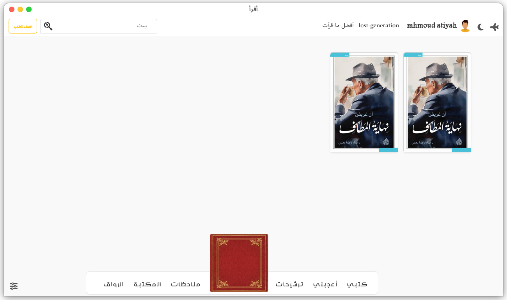

<div dir="rtl">

## اقرأ (قيد التطوير)
 مساعد قارئ تفاعلي متعدد المنصات مخصص للاستخدام للقراء العرب



## المميزات

<div dir="rtl">
- تنظيم كتبك بالطريقة التي تريد من خلال نظام tags عن طريقة تقسيمها حسب الرغبة.
</div>
<div dir="rtl">
- تحميل بياناتك السابقة من goodreads أو Google Books أو من الاستخدام السابق للبرنامج.
</div>
<div dir="rtl">
- إذا كنت مدير مكتبة وتبحث عن مساعد ذكي وقوي فبإمكانك تنظيم المكتبة والفئات والأسعار وتحميل بياناتك بسهولة من خلال ملف Excel او OCR Scan.
</div>
<div dir="rtl">
- بإمكانك إستخدام المكتبة بنظام المكتبة العامة (يمكن للمستخدمين الوصول إليها) ويمكنك تحديد من يمكنه الوصول ونوع المصدر المتاح له وغيره.
</div>
<div dir="rtl">
  - من خلال الرواق والذي يعمل بوضعبة المناقشة أو الشرح يمكنك إنشاء جلسات مشاركة تفاعلية.
</div>
<div dir="rtl">
- من خلال الرواق وفي وضع المناقشة يمكنك وأصدفائك مناقشة كتاب معين وبطرق مختلفة (صوت-فيديو-رسالة) .
</div>
<div dir="rtl">
- من خلال الرواق وفي وضع الشرح يمكنك وتلامذتك شرح درس أو موضوع معين مع وجود إضافات مساعدة مثل لوحة الشرح واقلام الشرح على النصوص والصور.
</div>
<div dir="rtl">
- لا داعي للتعب لإنشاء جلسة رواق يمكنك الإنضمام بسهولة من خلال الرقم التعريفي للجلسة.
</div>
<div dir="rtl">
- بإمكانك معرفة الكتاب الأكثر مبيعاً والأكثر قراءة اﻵن في الوطن العربي.
</div>
<div dir="rtl">
- من خلال الضغط على الملاحظات تستطيع تسجيل ملاحظاتك حسبما تريد.
</div>
<div dir="rtl">
-  دعم نافذة النوتة الخارجية بكثير من الميزات لتساعدك في تدوين الملاحظات.
</div>
<div dir="rtl">
- يمكنك التفاعل الكامل من خلال التعليق على كتاب معين.
</div>
<div dir="rtl">
- تم إضافة قاريء إلكتروني للكتب يساعدك في القراءة.
</div>
<div dir="rtl">
- توفير مصادر متنوعة للكتب لراحتك من معاناة البحث عن كتاب كما يمكنك إضافة مصادر اخري.
</div>
<div dir="rtl">
- شريط حالة يبين مدى إنجازك لهذا العام حتى اﻵن.
</div>
<div dir="rtl">
- يمكنك تغيير ما يعرض في الصغحة الرئيسية.
</div>
<div dir="rtl">
- قائمة ترشيحات بناء على ما تقرأه.
</div>
<div dir="rtl">
-التطبيق يدعم الوضع المظلم.
</div>
<div dir="rtl">
- لا داعي لإستخدام كثير من التطبيقات لإتمام عملية شراء الكتب فالان تستطيع بضغطة زر واحد شراء ما تريد. ( الشراء حاليا يتم من خلال موفر الكتب وليس التطبيق )
</div>

### طريقة التثبيت

أولاً، قم بتثبيت [NodeJS](https://nodejs.org/en/download/)
ثم قم بتنزيل الكود إلى المكان الذي ترغب فيه باستخدام الأمر التالي:
```bash
git clone https://github.com/Mhmoud-Atiyah/iqraa.git
cd iqraa
git submodule init
git submodule update
```

استخدم مدير الحزم [npm](https://www.npmjs.com/) لتثبيت أقراء.

```bash
npm install
```
ثم حسب النظام
```bash
npm run-script windows-package # لمستخدمي Windows
npm run-script mac-package # لمستخدمي mac
npm run-script linux-package # لأجهزة لينكس
```

## طور معي من الكود المصدر
استخدم مدير الحزم [npm](https://www.npmjs.com/) لبناء أقراء.

لتشغيله بدون تثبيت:
```bash
npm start 
npm install 
```
تثبيت
```
npm run-script build 
``` 

## المساهمة
أرحب بطلبات السحب (Pull Requests). يُرجى فتح مشكلة (Issue) أولًا لمناقشة أي تغييرات ترغب في إجرائها.
يرجى التأكد من تحديث الاختبارات حسب الاقتضاء.

## تواصل
يُمكنك التواصل معي في أي وقت عبر البريد الإلكتروني:
[MhmoudAtiyah](mahmoudaboattia1999@gmail.com)

## الترخيص
حقوق التأليف والنشر (c) Pyramido. كل الحقوق محفوظة.
تُرخص بواسطة ترخيص [MIT](https://choosealicense.com/licenses/mit/).
